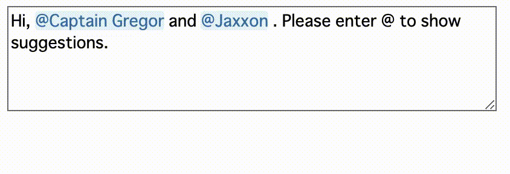
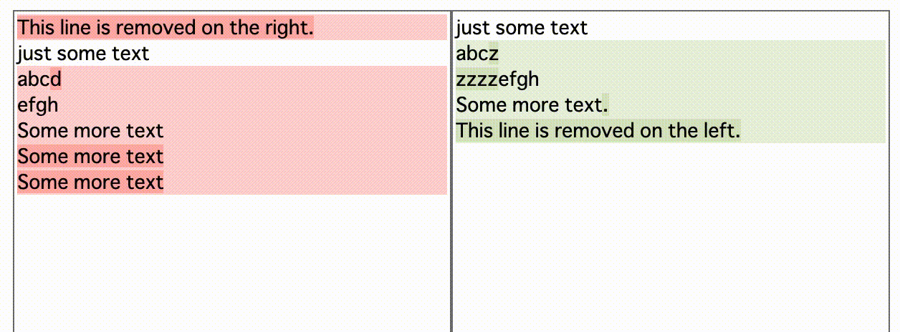
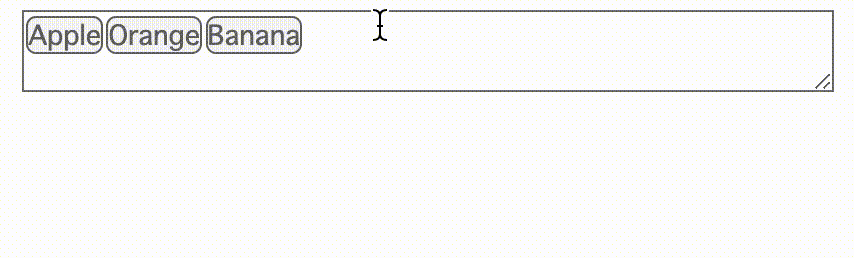
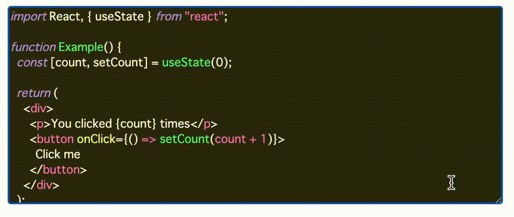
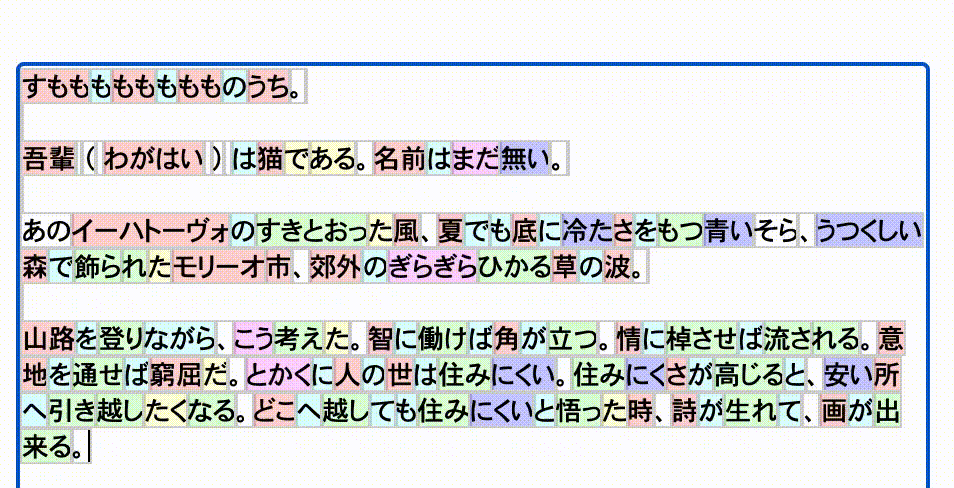

# rich-textarea

    

A small customizable textarea for [React](https://github.com/facebook/react) to colorize, highlight, decorate texts, offer autocomplete and much more.

> [!NOTE]
> You may also like https://github.com/inokawa/edix







## Demo

https://inokawa.github.io/rich-textarea/

## Features

- **Styleable texts:** Not just highlighting texts like similar libraries, this library also supports colorizing, decorating and more. Regex or any tokenizers can be used.
- **Easy to interact with events:** You can get caret position and can catch some mouse events on texts, which are useful to display something reflects user actions.
- **Compatible with textarea:** Except added features, this library is designed to behave as native [textarea](https://developer.mozilla.org/en-US/docs/Web/HTML/Element/textarea) as much as possible. If not worked properly, please report it in an [issue](https://github.com/inokawa/rich-textarea/issues) or [PR](https://github.com/inokawa/rich-textarea/pulls).
- **Out of the box integration:** Works as both [controlled](https://react.dev/reference/react-dom/components/textarea#controlling-a-text-area-with-a-state-variable) and [uncontrolled](https://react.dev/reference/react-dom/components/textarea#providing-an-initial-value-for-a-text-area). Supports [formik](https://github.com/jaredpalmer/formik), [react-hook-form](https://github.com/react-hook-form/react-hook-form), [@tanstack/react-form](https://github.com/TanStack/form) and more. Supports SSR. Supports form with [Server Actions](https://nextjs.org/docs/app/api-reference/functions/server-actions) in [Next.js](https://github.com/vercel/next.js) and [action in Remix](https://remix.run/docs/en/main/route/action).
- **IME composition handling:** [IME](https://en.wikipedia.org/wiki/Input_method) related events have some cross browser problems. This library handles them for easy to use.
- **Lightweight:** Trying to support many usecases but also keep bundle size small. Currently [~3kB (gzipped)](https://bundlephobia.com/package/rich-textarea).

## Motivation

Sometimes we need customized text editor in web. However creating it with [raw contenteditable is so hard to do properly](https://github.com/grammarly/contenteditable) and editor frameworks are usually too heavy... Maybe you really need is just a textarea with highlighting and some hovered menus, but native textarea and many of textarea libraries are far from it because of the limited customizability. This library is aiming to solve the problem.

## Install

```sh
npm install rich-textarea
```

### Requirements

- react >= 16.14

If you use ESM and webpack 5, use react >= 18 to avoid [Can't resolve `react/jsx-runtime` error](https://github.com/facebook/react/issues/20235).

## Usage

### Controlled

```jsx
import { useState } from "react";
import { RichTextarea } from "rich-textarea";

export const App = () => {
  const [text, setText] = useState("Lorem ipsum");

  return (
    <RichTextarea
      value={text}
      style={{ width: "600px", height: "400px" }}
      onChange={(e) => setText(e.target.value)}
    >
      {(v) => {
        return v.split("").map((t, i) => (
          <span key={i} style={{ color: i % 2 === 0 ? "red" : undefined }}>
            {t}
          </span>
        ));
      }}
    </RichTextarea>
  );
};
```

### Uncontrolled

```jsx
import { RichTextarea } from "rich-textarea";

export const App = () => {
  return (
    <RichTextarea
      defaultValue="Lorem ipsum"
      style={{ width: "600px", height: "400px" }}
    >
      {(v) => {
        return v.split("").map((t, i) => (
          <span key={i} style={{ color: i % 2 === 0 ? "red" : undefined }}>
            {t}
          </span>
        ));
      }}
    </RichTextarea>
  );
};
```

### Regex helper

You can use helper for regex if you don't want to create your own render function.

```jsx
import { useState } from "react";
import { RichTextarea, createRegexRenderer } from "rich-textarea";

const renderer = createRegexRenderer([
  [/[A-Z][a-z]+/g, { borderRadius: "3px", backgroundColor: "#d0bfff" }],
]);

export const App = () => {
  const [text, setText] = useState("Lorem ipsum");

  return (
    <RichTextarea
      value={text}
      style={{ width: "600px", height: "400px" }}
      onChange={(e) => setText(e.target.value)}
    >
      {renderer}
    </RichTextarea>
  );
};
```

### Next.js Server Actions

```tsx
// _components/Textarea.tsx
"use client";
import { RichTextarea, RichTextareaProps } from "rich-textarea";

export const Textarea = (
  props: Omit<RichTextareaProps, "children" | "ref">
) => {
  return (
    <RichTextarea {...props}>
      {(v) => {
        return v.split("").map((t, i) => (
          <span key={i} style={{ color: i % 2 === 0 ? "red" : undefined }}>
            {t}
          </span>
        ));
      }}
    </RichTextarea>
  );
};

// page.tsx in App Router of Next.js
import { Textarea } from "../_components/Textarea";

async function hello(formData: FormData) {
  "use server";
  console.log(formData.get("hello"));
}

export default () => {
  return (
    <div>
      <div>this is server!</div>
      <form action={hello}>
        <Textarea defaultValue="Lorem ipsum" name="hello" />
        <button type="submit">submit</button>
      </form>
    </div>
  );
};
```

### Remix action

```tsx
import type { ActionFunction } from "@remix-run/node";
import { Form } from "@remix-run/react";
import { RichTextarea, RichTextareaProps } from "rich-textarea";

const Textarea = (props: Omit<RichTextareaProps, "children" | "ref">) => {
  return (
    <RichTextarea {...props}>
      {(v) => {
        return v.split("").map((t, i) => (
          <span key={i} style={{ color: i % 2 === 0 ? "red" : undefined }}>
            {t}
          </span>
        ));
      }}
    </RichTextarea>
  );
};

export const action: ActionFunction = async ({ request }) => {
  console.log((await request.formData()).get("hello"));
};

export default () => {
  return (
    <Form method="post">
      <Textarea defaultValue="Lorem ipsum" name="hello" />
      <button type="submit">submit</button>
    </Form>
  );
};
```

## Documentation

- [API reference](./docs/API.md)
- [Examples](./stories) for more usages

## Contribute

All contributions are welcome.
If you find a problem, feel free to create an [issue](https://github.com/inokawa/rich-textarea/issues) or a [PR](https://github.com/inokawa/rich-textarea/pulls).

### Making a Pull Request

1. Fork this repo.
2. Run `npm install`.
3. Commit your fix.
4. Make a PR and confirm all the CI checks passed.
