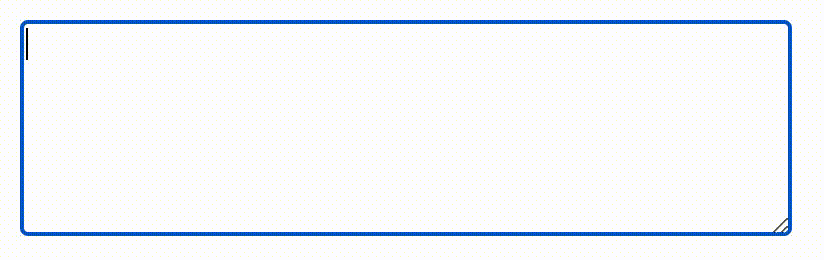
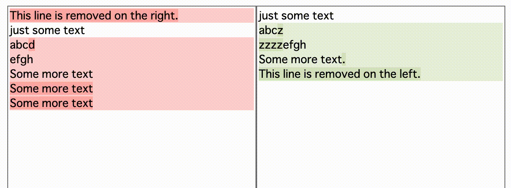
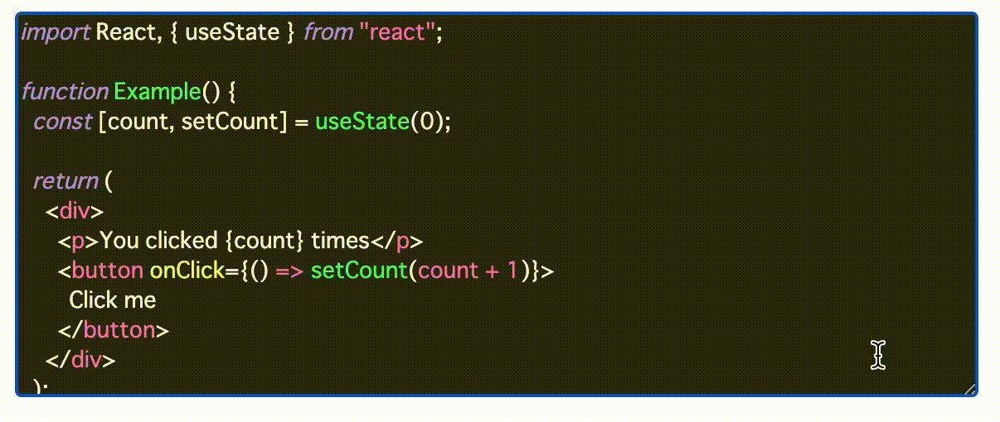

# rich-textarea

 
 

A small [React](https://github.com/facebook/react) component to colorize, highlight and decorate your textarea.





## Demo

https://inokawa.github.io/rich-textarea/

## Overview

Sometimes we need rich text editor in web. However creating it with [raw contenteditable is so hard](https://github.com/grammarly/contenteditable) and editor frameworks are usually too heavy... Maybe all you really need is just a textarea with highlighting?

This library is a simple native [textarea](https://developer.mozilla.org/en-US/docs/Web/HTML/Element/textarea) but has a function to style texts with regex or other tokenizers.
Not just highlighting texts like similar libraries, this library also supports colorizing, decorating and more.

## Install

```sh
npm install rich-textarea
```

### Requirements

- react >= 17.0

## Usage

```jsx
import * as React from "react";
import { RichTextarea, createRegexRenderer } from "rich-textarea";

const renderer = createRegexRenderer([
  [/[A-Z][a-z]+/g, { borderRadius: "3px", backgroundColor: "#d0bfff" }],
]);

export const App = () => {
  const [text, setText] = React.useState("Lorem ipsum");

  return (
    <RichTextarea
      value={text}
      style={{ width: "600px", height: "400px" }}
      onChange={(e) => setText(e.target.value)}
    >
      {renderer}
    </RichTextarea>
  );
};
```
