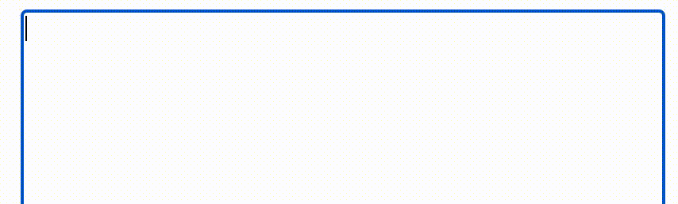

# rich-textarea

 
 

A small customizable textarea for [React](https://github.com/facebook/react) to colorize, highlight, decorate texts, offer autocomplete and much more.





## Demo

https://inokawa.github.io/rich-textarea/

## Features

- **Styleable texts:** Not just highlighting texts like similar libraries, this library also supports colorizing, decorating and more. Regex or any tokenizers can be used.
- **Easy to interact with events:** You can get caret position and can catch some mouse events on texts, which are useful to display something reflects user actions.
- **Compatible with textarea:** Except added features, this library is designed to behave as native [textarea](https://developer.mozilla.org/en-US/docs/Web/HTML/Element/textarea) as much as possible. If not worked properly, please report it in an [issue](https://github.com/inokawa/rich-textarea/issues) or [PR](https://github.com/inokawa/rich-textarea/pulls).
- **Lightweight:** Trying to support many usecases but also keep bundle size small. Currently [about 3kB (gzipped)](https://bundlephobia.com/package/rich-textarea).

## Motivation

Sometimes we need customized text editor in web. However creating it with [raw contenteditable is so hard to do properly](https://github.com/grammarly/contenteditable) and editor frameworks are usually too heavy... Maybe you really need is just a textarea with highlighting and some hovered menus, but native textarea and many of textarea libraries are far from it because of the limited customizability. This library is aiming to solve the problem.

## Install

```sh
npm install rich-textarea
```

### Requirements

- react >= 16.14

## Usage

```jsx
import * as React from "react";
import { RichTextarea, createRegexRenderer } from "rich-textarea";

const renderer = createRegexRenderer([
  [/[A-Z][a-z]+/g, { borderRadius: "3px", backgroundColor: "#d0bfff" }],
]);

export const App = () => {
  const [text, setText] = React.useState("Lorem ipsum");

  return (
    <RichTextarea
      value={text}
      style={{ width: "600px", height: "400px" }}
      onChange={(e) => setText(e.target.value)}
    >
      {renderer}
    </RichTextarea>
  );
};
```

And see [examples](./stories) for more usages.

## Props

For other props not mentioned below will be passed to textarea.

| Name              | Type                                          | Default     | Description                                                                                                                                                                                                                                                               |
| ----------------- | --------------------------------------------- | ----------- | ------------------------------------------------------------------------------------------------------------------------------------------------------------------------------------------------------------------------------------------------------------------------- |
| value             | `string`                                      | required    | Same as textarea but only string                                                                                                                                                                                                                                          |
| defaultValue      | -                                             | -           | Omitted for simplicity of logic                                                                                                                                                                                                                                           |
| children          | `(value: string) => React.ReactNode`          | `undefined` | This function should return ReactNodes which texts are positioned the same as textarea (see examples for detailed usage). Currently limited event handlers will work for the nodes (`onClick`, `onMouseOver`, `onMouseOut`, `onMouseMove`, `onMouseDown` and `onMouseUp`) |
| autoHeight        | `boolean`                                     | `undefined` | If true, textarea height is automatically resized and height of style prop does not work. Set `maxHeight` to style prop if you need limit.                                                                                                                                |
| onSelectionChange | `(pos: CaretPosition, value: string) => void` | `undefined` | Called when selection in textarea changes. It gives position of caret at the time, which is useful to position menu.                                                                                                                                                      |

## Methods

| Name              | Type                                   | Description                                                                                                                                       |
| ----------------- | -------------------------------------- | ------------------------------------------------------------------------------------------------------------------------------------------------- |
| ref               | `React.RefObject<HTMLTextAreaElement>` | Ref of textarea                                                                                                                                   |
| selectionStart    |                                        | Same as [textarea](https://developer.mozilla.org/en-US/docs/Web/API/)                                                                             |
| selectionEnd      |                                        | Same as [textarea](https://developer.mozilla.org/en-US/docs/Web/API/)                                                                             |
| focus             |                                        | Same as [textarea](https://developer.mozilla.org/en-US/docs/Web/API/HTMLTextAreaElement)                                                          |
| blur              |                                        | Same as [textarea](https://developer.mozilla.org/en-US/docs/Web/API/HTMLTextAreaElement)                                                          |
| select            |                                        | Same as [textarea](https://developer.mozilla.org/en-US/docs/Web/API/HTMLTextAreaElement)                                                          |
| setSelectionRange |                                        | Same as [textarea](https://developer.mozilla.org/en-US/docs/Web/API/HTMLTextAreaElement)                                                          |
| setRangeText      |                                        | Same as [textarea](https://developer.mozilla.org/en-US/docs/Web/API/HTMLTextAreaElement) but has fallback to `document.execCommand("insertText")` |
